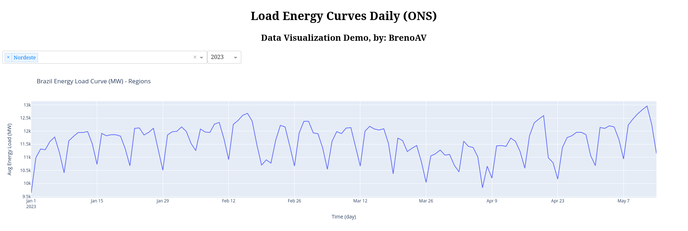
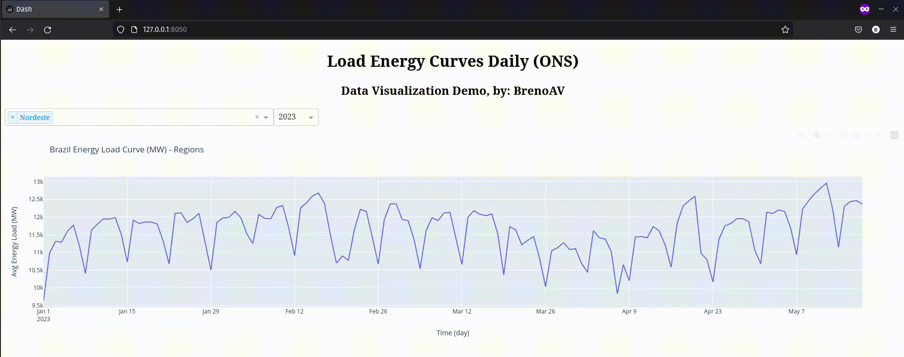
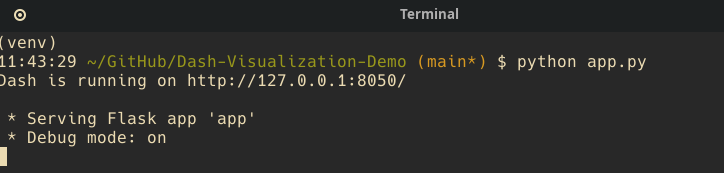

# ONS Dash Visualization

This (simple) repository is designated for my studies and application of Dash (Plotty) for the purpose of data visualization. I'm using data from [ONS OPEN DATA](https://dados.ons.org.br/) provided by ONS (Operador Nacional do Sistema Elétrico).

<p align="center">

</p>

Animated gif showing the results:

<p align="center">

</p>

# Reproducibility

## Download .csv files

I created a bash script [`download_dataset.sh`](download_dataset.sh) which is possible download the .csv files using `wget`

1. Grant the user (u) the permission to execute (x) the script:

```bash
$ chmod u+x download_dataset.sh
```

2. Execute the script:

```bash
$ ./download_dataset.sh
```

**Note:** You can download them one by one using your browser: https://dados.ons.org.br/dataset/carga-energia. Save the files in the folder called `data/`

## Create a virtual env (python)

I'm supposed that you're using [venv](https://docs.python.org/3/library/venv.html) and unix system

1. Create the environment:

```bash
$ python -m venv venv
```

2. Activate the environment:

```bash
$ source venv/bin/activate
```

3. Install the dependencies

```bash
$ pip install -r requeriments.txt
```

## Preprocessing and create the unique files with all years

- Open the jupyter notebook [`data_preprocessing.ipynb`](data_preprocessing.ipynb) and execute all the cells. **Note:** There're missing data values on the original data, this will trigger an exception. Just execute after this exception and the missing data will be filled by the next value.

- In the end, It'll created a directory called `outputs/` and the file: `energy_load_curve_brazil.csv`. This file will be used for feeding the data in Dash App

## Dash App

- You can now execute the `app.py` for generating the dash application:

```bash
$ python app.py
```



## Execute the tests

Go to the root folder and execute:

```bash
$ python -m unittest discover tests/
```

---

<div align="center">
  <strong>Thank you for visiting!</strong>
</div>

<p align="center">
  <sub>Created by BrenoAV</sub>
</p>

# TODO

- [ ] Add others data
